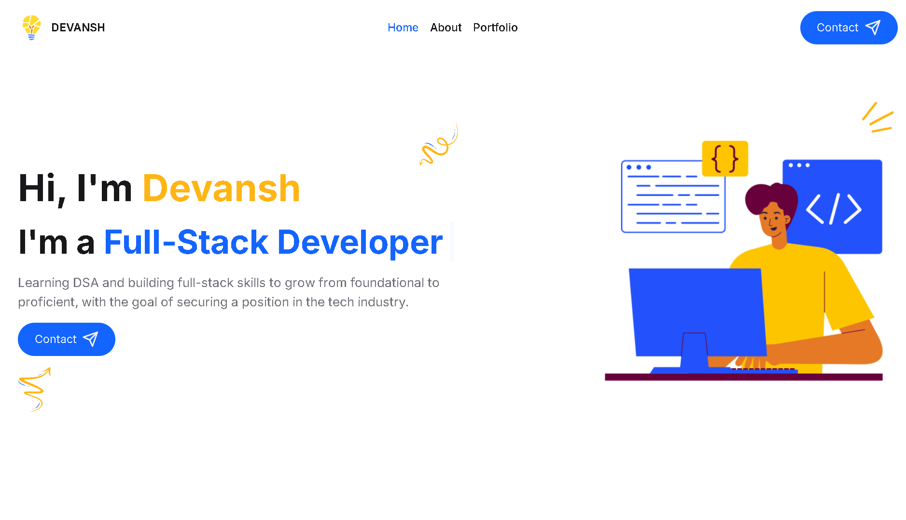

# 🌟 Devansh's Portfolio

Welcome to my portfolio website! 🎨 This site showcases my projects and provides my contact details. It is built with React, deployed using Vite, and leverages EmailJS for form submissions. I’ve used Lucide React and Framer Motion libraries to enhance the visual appeal and animations.

## Features 🚀

- **Showcase of Projects:** Displays all my projects with details and links. 🛠️
- **Contact Form:** Allows visitors to reach out directly through a contact form. ✉️
- **Beautiful Animations:** Enhanced with [Framer Motion](https://www.framer.com/motion/) for smooth animations. ✨
- **Iconography:** Utilizes [Lucide React](https://lucide.dev/) for modern icons. 🖼️
- **Responsive Design:** Ensures the portfolio looks great on all devices. 📱💻

## Demo 🎥

You can view the live version of the portfolio at [your-deployed-domain.com](https://devanshportfolio-devil-1964s-projects.vercel.app/).

## Technologies Used 🛠️

- **React:** Frontend library for building user interfaces. ⚛️
- **Vite:** Build tool for fast development and optimized builds. ⚡
- **EmailJS:** For handling email sending from the contact form. 📧
- **Framer Motion:** For animations and transitions. 🎬
- **Lucide React:** For high-quality icons. 🔍
